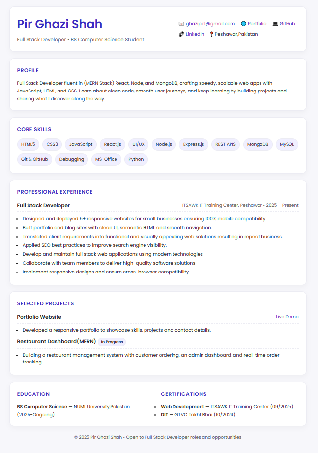

# 📄 Pir Ghazi Shah — Resume

My professional resume built with **HTML** and **CSS**.  
Designed to be **clean, responsive, and ATS-friendly**, showcasing my skills, projects and professional experience.

---

## 🚀 Features
- Responsive layout optimized for desktop and mobile
- Clean and minimal UI with modern typography
- Sections: Summary, Skills, Experience, Projects, Education, Certifications
- Easy to update and customize

---

## 🌐 Live Demo
👉 [View Resume](https://ghazi829.github.io/Ghazi-Resume/)  

---

## 📸 Preview

---

## 🛠️ Technologies Used
- HTML5  
- CSS3 (Flexbox & Grid)  
- Google Fonts (Poppins)

---

## 📬 Contact
- Email: [ghazipir1@gmail.com](mailto:ghazipir1@gmail.com)  
- GitHub: [ghazi829](https://github.com/ghazi829)  
- LinkedIn: [Pir Ghazi Shah](https://linkedin.com/in/pir-ghazi-shah)  